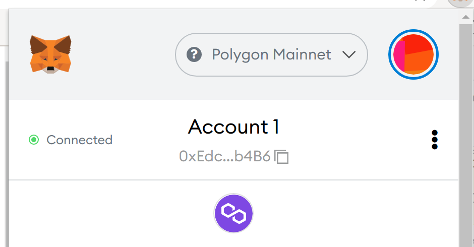

# Step 1: Install Metamask

[MetaMask](https://metamask.io/) is a crypto wallet that enables you to connect to Ethereum's blockchain from your browser. MetaMask supports Chrome, Firefox, Opera and Brave. See [this step-by-step guide](https://levelup.gitconnected.com/how-to-use-metamask-a-step-by-step-guide-f380a3943fb1) for installing Metamask.

# Step 2: Connect to the Ethereum network

Click the Metamask extension and connect to the Ethereum Mainnet.

*[Note for advanced readers: If you are testing JohnLawCoin on the Ropsten Testnet, connect to the Ropsten Testnet instead.]*

# Step 3: Connect your account with the JohnLawCoin wallet

Open the wallet and then click the Metamask extension. Make sure that your account is marked as "Connected".

If it's marked as "Not connected", click it and then connect your account.

# Step 4: Deposit ETH

You need to deposit some ETH to your account to use JohnLawCoin because JohnLawCoin is implemented on the Ethereum blockchain and thus you need to pay the transaction fee in ETH. Please buy some ETH from a cryptocurrency exchanger and deposit it to your account.

*[Note for advanced readers: If you are testing JohnLawCoin on the Ropsten Testnet, you can get some ETH from [the faucet](https://faucet.metamask.io/).]*
