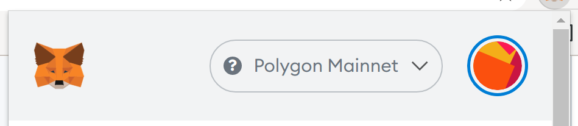
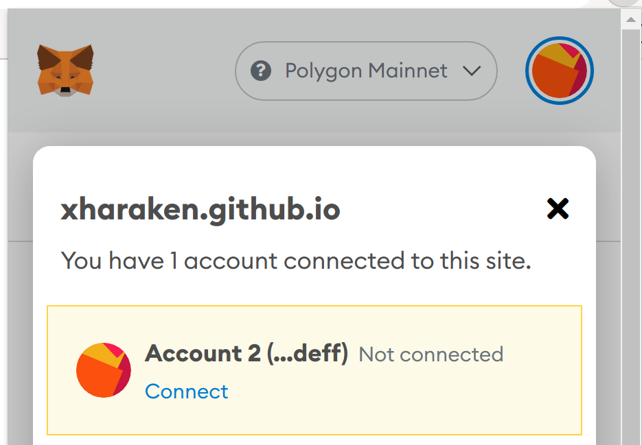

# Step 1: Install Metamask

[MetaMask](https://metamask.io/) is a crypto wallet that enables you to connect to Ethereum's blockchain from your browser. MetaMask supports Chrome, Firefox, Opera and Brave. See [this step-by-step guide](https://levelup.gitconnected.com/how-to-use-metamask-a-step-by-step-guide-f380a3943fb1) for installing Metamask.

# Step 2: Connect to the Polygon Mainnet

Follow [this instruction](https://docs.polygon.technology/docs/develop/metamask/config-polygon-on-metamask/) and add the Polygon Mainnet to your Metamask.

*[Note for advanced readers: If you are testing JohnLawCoin on the Rinkeby Testnet, connect to the Rinkeby Testnet instead.]*

# Step 3: Connect your account with the wallet

Open [the wallet](https://xharaken.github.io/john-law-coin/wallet/wallet.html). It will automatically pop up the Metamask extension. Follow the instruction and connect your account with the wallet.

Click the Metamask extension and make sure that your account is marked as "Connected".

If it's marked as "Not connected", click it and then connect your account.

# Step 4: Deposit MATIC

You need to deposit some MATIC to your Polygon wallet to use JohnLawCoin because you need to pay the transaction fee in MATIC. There are [multiple ways](https://medium.com/prepo/setting-up-metamask-and-getting-eth-matic-on-polygon-step-by-step-guide-fd55147a0f05) to get MATIC. The easiest way is to buy MATIC at [Binance](https://www.binance.com/) or [Ascendex](https://ascendex.com/en/global-digital-asset-platform) and withdraw it to your Polygon wallet directly. As of 2022 Jan, the transaction fee of the Polygon Mainnet is around $0.01 - $0.05 per transaction. Putting $10 of MATIC will be sufficient to play with JohnLawCoin.

# Note for developers: How to connect to the Rinkeby Testnet

JohnLawCoin Beta is deployed on the Rinkeby Testnet for testing purposes. To play with JohnLawCoin Beta, choose the Rinkeby Testnet in your Metamask. You can get some ETH for free from a [faucet here](https://faucet.rinkeby.io/). JohnLawCoin Beta is only for testing and the state may be reset without any notice.

